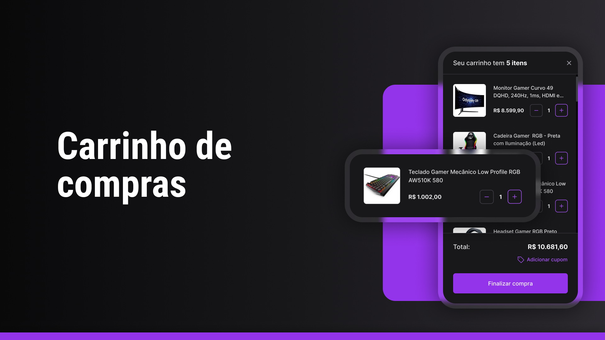

<h1 align="center">Habits</h1>

  [Projeto](#projeto) 
  &nbsp;&nbsp;&nbsp;|&nbsp;&nbsp;&nbsp;
  [Tecnologias](#tecnologias)
  &nbsp;&nbsp;&nbsp;|&nbsp;&nbsp;&nbsp;
  [Layout](#layout)
    &nbsp;&nbsp;&nbsp;|&nbsp;&nbsp;&nbsp;
  [Licença](#license)

  

 

 
 

## 💻 Projeto 

Esse projeto foi desafio do #boracodar da rocketseat com intuito de praticar habilidades tecnicas de frontend com Next.js, Redux e TypeScript. 

 
 

## 🚀 Tecnologias 

- TypeScript
- Next.js
- Redux

 
 

## 🔖 Layout 

Você pode visualizar o layout do projeto através [DESSE LINK](https://www.figma.com/community/file/1243194167725942248). É necessário ter conta no [Figma](https://figma.com) para acessá-lo.

 
 

## 🔒 Licença 

Esse projeto está sob a licença MIT.

